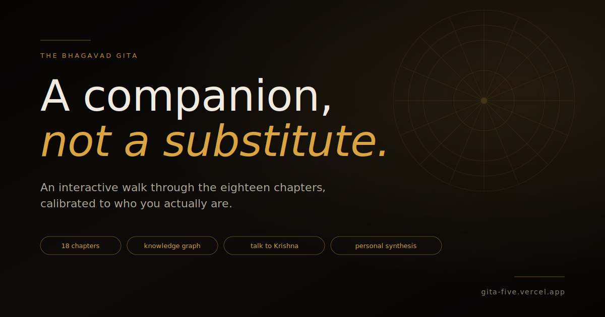

# The Bhagavad Gita · Companion

An interactive companion for the Bhagavad Gita. Read the eighteen chapters as a graphic-novel storyboard, explore the characters and concepts as a knowledge graph, talk to Krishna about your actual life, and walk away with a personal synthesis you can keep.

**Live:** [gita-five.vercel.app](https://gita-five.vercel.app)

A companion to the text, not a substitute. Built for people who want the Gita's substance without first committing to read all 700 verses — and for people who have read it and want a different way back in.



---

## What the Gita actually is

The Bhagavad Gita is a 700-verse dialogue at the center of the Mahabharata, written somewhere between 200 BCE and 200 CE. It opens on a battlefield. Two armies face each other across a field at Kurukshetra. They are cousins. A war that will end an age is about to begin.

Arjuna — the greatest archer of his generation — asks his charioteer to drive him into the middle, between the two armies, so he can see who he must fight. He sees his teachers. His grandfather. His cousins. His childhood friends. He drops his bow. He sits down in the chariot. He tells the charioteer he cannot do this.

The charioteer is Krishna — Arjuna's friend, his cousin, and (Arjuna does not yet realize it) the divine in human form, who has vowed not to fight in this war. Krishna does not lift Arjuna up with comfort. He does not tell him to do whatever feels right. He gives Arjuna eighteen chapters of the most direct moral and metaphysical instruction in any major religious text, and at the end he says: *"I have told you everything. Reflect on it fully. Then do as you wish."* Arjuna picks up his bow.

That is the entire frame. The whole text is one conversation between a man who cannot move forward and the friend who refuses to let him collapse.

## What the Gita actually teaches

The teachings braid through three paths — **karma yoga** (the path of action), **bhakti yoga** (the path of devotion), and **jnana yoga** (the path of knowledge) — but they all answer the same question: *how do you act in a real situation that has no clean resolution?*

A few of the central moves:

**You cannot escape action.** The wish to renounce, retreat, abstain, or wait until you understand more is itself an action. There is no neutral position. The only question is *how* you act — what you cling to, what you release, what stance you act from.

**Act fully, then release the result.** The most quoted verse in Hinduism (2.47) is sometimes translated as *"You have a right to your work, but never to its fruits."* The point is not passivity. The point is that attachment to outcome is what makes work poison and burnout inevitable. Do the work because the work is yours. Do not negotiate with reality about what it will repay.

**You are not your thoughts.** The body is a field. The mind is part of the field. Your emotions, your memories, your sense of self — all field. There is something else watching all of it. Therapy rediscovered this in the twentieth century. The Gita has been saying it for two thousand years.

**The mind is restless, and that is fine.** Arjuna tells Krishna *"the mind is impossible to control — it's restless, stubborn, like trying to hold the wind."* Krishna does not say *try harder*. He says *you're right. AND it can still be done. AND if you fall off, you don't lose progress.* You don't restart. You resume.

**Most paths converge.** Whatever you can offer — a leaf, a flower, water, your work, your attention — given with the right intention, is enough. The Gita is not gatekept. The teaching is rare because attention is rare, not because the door is hidden.

**The end is not certainty.** Krishna's final move with Arjuna is not to compel or convince. He gives Arjuna everything and steps back. *"Reflect. Then do as you wish."* Arjuna picks up the bow not because he has to, but because, finally, the doubt is gone. Whatever you have been agonizing over — the Gita ends with you doing it. Not certain. Not perfect. Steady.

## How to apply this without becoming a different person

The Gita does not ask you to renounce the world, leave your job, become a vegetarian, sit in a cabin, or take up a religion. It asks something harder: stay where you are, do what is in front of you, and stop negotiating with reality about whether it should be different. That is the teaching. Everything else is footnotes.

The way to use this app is the way to use the text:

1. **Bring a real situation.** Not "I would like to be wiser in general" — a specific freeze, a specific decision, a specific weight you are carrying. The Gita is a dialogue. It only works when you are in it.
2. **Read each chapter as a scene, not a doctrine.** The storyboard format is intentional. The Gita is theater before it is theology — Arjuna and Krishna are characters, the battlefield is the staging, the dialogue is the substance.
3. **Personalize the Modern Mirror.** Each chapter ends with a generic translation of its teaching to a present-day life. With your reader profile, the app generates a second Mirror calibrated to your specific situation. Read both. Notice what the personalized version says that the universal one couldn't.
4. **Ask hard questions.** The Ask tab opens a multi-turn dialogue with Krishna, grounded in your reader profile. Bring real questions. *"Should I leave my job?" "Why am I afraid of dying?" "What do I owe my parents?"* Krishna answers in the dialogue's voice, not as a modern explainer.
5. **Read the synthesis at the end.** Once you have personalized at least six chapters, Chapter 19 unlocks — a generated synthesis that pulls the through-line across what was said to you, with a final word in the structure of Krishna's actual closing teaching (release this, hold to that, stop grieving the third). Download it as a PDF if you want to keep it.

The point is not to become a different person. The point is to stop fighting yourself about being the person you actually are, in the situation you are actually in, with the obligations you actually have. That is what the Gita offers. That is what this app tries to make accessible.

---

## What this app does

**Storyboard tab** — All eighteen chapters as scenes with color-coded dialogue panels (Krishna blue, Arjuna coral, narrator gray). Each chapter ends with a Modern Mirror translating its teaching to a present-day life and a reflection prompt to sit with.

**Knowledge graph tab** — Thirty-three nodes (characters and concepts) connected by relationships, rendered as a force-directed graph. Tap any node for its fact sheet; tap related chips to walk sideways through the ideas.

**Ask tab** — Multi-turn dialogue with Krishna using your own OpenRouter key. Five preset Krishna voices (warrior-direct, patient explainer, intimate friend, cosmic revealer, final teacher) plus optional custom voice instruction. The LLM is grounded in your reader profile — it answers the question you actually asked, in your specific situation, not in the abstract.

**Profile** — A short intake (3, 7, or 12 questions, your choice). Builds a reader profile that personalizes Modern Mirrors and grounds Krishna's responses. Stays in your browser; never sent anywhere except OpenRouter when you invoke an LLM feature.

**Synthesis (Chapter 19)** — Once you have personalized at least six chapters, the synthesis unlocks. An LLM reads across all your personalized Mirrors and your profile to write a through-line specific to you, with a final word echoing Krishna's actual closing teaching. Downloadable as a PDF in two formats — Quick reference (synthesis + your eighteen Mirrors) or Full record (everything: profile + synthesis + personalized + universal Mirrors + final word).

## Tech

Next.js 14 (App Router), TypeScript, Tailwind CSS, framer-motion for transitions, d3-force for the graph layout, jsPDF for client-side PDF generation. LLM features use OpenRouter with the user's own API key — costs about a few cents to fully personalize and synthesize a complete reading.

All content lives in `lib/chapters.ts` and `lib/graph.ts` as plain TypeScript objects. No CMS, no backend, no database. The reader profile, progress, generated mirrors, and synthesis all live in browser localStorage.

## Run locally

```bash
npm install
npm run dev
```

Open `http://localhost:3000`.

## Deploy

```bash
npx vercel --prod
```

Auto-deploys on push when the GitHub repo is connected to a Vercel project.

## Editing content

- **Chapters:** `lib/chapters.ts` — each chapter has scenes, panels, a Modern Mirror, a reflection prompt, "Why this?" tangent prompts, and lists of related concept and character IDs.
- **Knowledge graph:** `lib/graph.ts` — `NODES` for characters and concepts, `EDGES` for relationships.
- **Portraits:** `components/Portraits.tsx` — inline SVG, edit colors and shapes directly.
- **Theme:** `tailwind.config.js` and `app/globals.css` — Krishna / Arjuna / Dust / Dharma color palettes.
- **Ask Krishna voices:** `lib/ask-personas.ts` — add or modify preset voices.
- **System prompts:** `lib/ask-system-prompt.ts` (chat) and `app/api/personalize/route.ts` (per-chapter), `app/api/synthesize/route.ts` (chapter 19).

## A note on sources

The Modern Mirrors, concept summaries, and dialogue paraphrases in this app are original work informed by multiple translations of the Gita — primarily Eknath Easwaran (Nilgiri Press) and Stephen Mitchell. No copyrighted translation is reproduced verbatim. Sanskrit terms and verse references come from the public-domain text. For the verses themselves, please read one of the original translations — the app is a companion, not a replacement.

If you are reading the Gita for the first time, I recommend the Easwaran translation. It is the most readable in modern English and includes a chapter-by-chapter introduction that puts each teaching in context.

## Privacy

Everything stays in your browser. The reader profile, reading progress, generated Modern Mirrors, conversation history, and synthesis all live in localStorage on your device. The only outbound network requests are:

- Loading the app's static assets from Vercel
- LLM API calls to OpenRouter (only when you use Ask, Personalize, or Synthesize) — using *your* API key, billed to *your* OpenRouter account, never proxied through any server controlled by this project

There is no analytics, no telemetry, no account, no cloud sync. Closing the browser tab does not lose your data; clearing browser storage does. Treat the synthesis PDF as your durable record.

## License

MIT — see [LICENSE](LICENSE). Use, fork, learn from it. If you build something with it, I would genuinely like to see what you made.

This is a personal project, not actively accepting PRs, but issues and suggestions are welcome.

---

Built by [Dana Schreiber](https://github.com/dkschrei). Companion app to [Pantheon](https://pantheon-lilac.vercel.app).

*"You have a right to your work, but never to its fruits. Let not the fruits of action be your motive, nor let your attachment be to inaction."* — Bhagavad Gita 2.47
